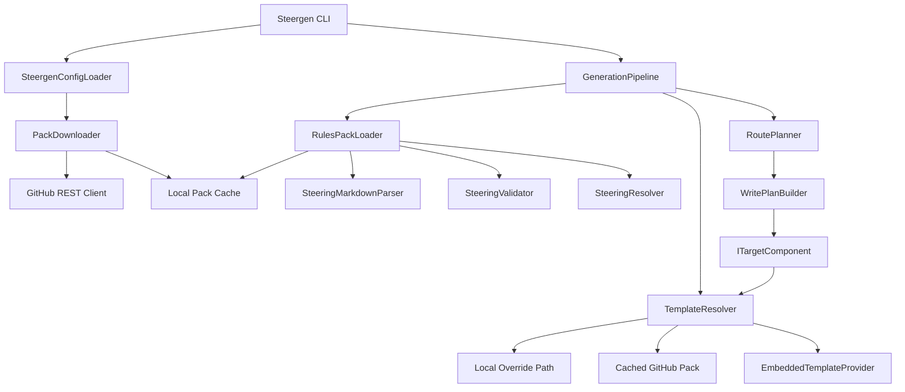

# Design Document: Custom Template Packs and Rules Packs

## Overview

This feature extends Steergen with two pack-based extensibility mechanisms and retires the legacy `globalRoot` configuration:

1. **Template Packs** — User-provided Scriban templates that override built-in rendering for specific targets, or provide complete target definitions for new external targets. Sourced from local directories or GitHub repositories.
2. **Rules Packs** — Shared governance rule sets published to GitHub repositories, loaded and merged alongside project-local rules with scope-based precedence.
3. **globalRoot Retirement** — The legacy `globalRoot` configuration field is removed; its use case is fully replaced by rules packs with `scope: global`.

The design preserves all existing architectural invariants: no dynamic plugin loading, deterministic outputs, additive-only changes, and clear separation between parsing → model → validation → routing → rendering.

### Design Rationale

The current `globalRoot` mechanism is a filesystem path coupling that doesn't support versioning, sharing across teams, or scope-based precedence. Template packs address the need for output customisation without forking the tool. Rules packs address the need for shared governance without manual file copying. Both use the same GitHub-based distribution and local caching pattern, keeping the mental model consistent.

The external target pack model provides the extensibility path for new targets without dynamic plugin loading. A pack author provides templates and a default layout YAML; Steergen supplies a generic `PackTargetComponent` that delegates rendering to the pack's templates. This keeps the binary stable while allowing the target ecosystem to grow externally.

## Architecture

### Component Topology



### Pipeline Integration Points

The feature integrates at four points in the existing pipeline:

1. **Configuration loading** (step 1): Extended `SteeringConfiguration` model with `templatePack` and `rulesPacks` sections. Detection of deprecated `globalRoot` with error diagnostic.
2. **Target registration** (step 1): External targets declared in template pack `providedTargets` are registered alongside built-in targets, using a generic `PackTargetComponent`.
3. **Document discovery and merge** (steps 2–4): `RulesPackLoader` discovers, parses, validates, and feeds rules pack documents into `SteeringResolver` with scope metadata.
4. **Target rendering** (step 10): `TemplateResolver` replaces direct `EmbeddedTemplateProvider` usage, implementing the three-level override precedence chain with target-scoped filtering.

### Boundary Preservation

- The write plan remains the boundary between routing and rendering — packs do not affect routing logic.
- Template packs only affect the rendering step; they do not introduce new routing semantics.
- External target packs provide templates and a default layout but use the same routing and write-plan pipeline as built-in targets.
- Rules packs feed into the existing merge step; they do not bypass validation or introduce new rule semantics.
- No new runtime file dependencies are introduced for the default (no-pack) configuration.
- No dynamic plugin loading: external targets use a generic `PackTargetComponent` compiled into the binary, not dynamically loaded assemblies.

## Components and Interfaces

### TemplateResolver

Replaces direct `EmbeddedTemplateProvider` usage in target components. Implements `ITemplateProvider` with a three-level override chain and target-scoped filtering.

```csharp
namespace Steergen.Core.Targets;

/// <summary>
/// Resolves Scriban templates using a three-level override precedence:
/// 1. Local override path (templatePackPath in config)
/// 2. Cached GitHub pack (downloaded to local pack cache)
/// 3. Built-in embedded templates (EmbeddedTemplateProvider)
///
/// Template packs that declare a `targets` list are only consulted for
/// those declared targets. Packs without a `targets` list apply to all targets.
/// </summary>
public sealed class TemplateResolver : ITemplateProvider
{
    private readonly string? _localOverridePath;
    private readonly string? _cachedPackPath;
    private readonly ITemplateProvider _embeddedProvider;
    private readonly IReadOnlySet<string>? _declaredTargets;
    private readonly long _maxFileSizeBytes;

    public TemplateResolver(
        string? localOverridePath,
        string? cachedPackPath,
        ITemplateProvider embeddedProvider,
        IReadOnlySet<string>? declaredTargets = null,
        long maxFileSizeBytes = 1_048_576)
    { }

    public string GetTemplate(string targetId, string templateName)
    { }

    /// <summary>
    /// Returns the source layer that would provide the template.
    /// Used by `steergen inspect --templates`.
    /// </summary>
    public TemplateSource GetTemplateSource(string targetId, string templateName)
    { }

    /// <summary>
    /// Returns true if this resolver can provide templates for the given target.
    /// A resolver with no declared targets can provide for any target.
    /// </summary>
    public bool ProvidesForTarget(string targetId)
    { }
}

public enum TemplateSource
{
    LocalOverride,
    CachedGitHubPack,
    BuiltInEmbedded,
    ProvidedTarget  // Template from an external target pack
}
```

Resolution algorithm:
1. Compute path: `{layer}/{targetId}/{templateName}.scriban`
2. Check if the target is in the pack's declared `targets` list (if list is present)
3. Check local override path (if configured and directory exists)
4. Check cached GitHub pack path (if configured and downloaded)
5. Fall back to `EmbeddedTemplateProvider`

Target-scoped filtering:
- If `declaredTargets` is non-null, the resolver only serves templates for those targets at the local/cached layers
- If `declaredTargets` is null, the resolver serves templates for all targets (backward-compatible)
- Template files found under undeclared target directories emit a diagnostic warning

Constraints:
- Does NOT follow symbolic links (uses `FileAttributes` check before reading)
- Rejects files > 1 MB
- Uses ordinal file path comparison for deterministic enumeration
- Makes zero network requests

### PackManifest

Shared model for both template pack and rules pack manifests.

```csharp
namespace Steergen.Core.Packs;

public sealed record PackManifest
{
    public required string Name { get; init; }
    public required string Version { get; init; }
    public required string MinSteergenVersion { get; init; }
    public PackScope? Scope { get; init; }           // Required for rules packs
    public IReadOnlyList<string>? Targets { get; init; } // Override targets (template packs)
    public IReadOnlyList<ProvidedTargetDefinition>? ProvidedTargets { get; init; } // External targets
    public string? RulesRoot { get; init; }           // Optional, rules packs only
}

/// <summary>
/// Declares a complete target definition provided by a template pack.
/// The pack supplies templates and a default layout; Steergen supplies
/// the generic PackTargetComponent that delegates rendering.
/// </summary>
public sealed record ProvidedTargetDefinition
{
    public required string TargetId { get; init; }
    public required string DefaultLayout { get; init; } // Relative path to layout YAML within pack
    public string? Description { get; init; }
}

public enum PackScope
{
    Global,
    Supplemental,
    Project
}
```

### PackManifestParser

```csharp
namespace Steergen.Core.Packs;

public sealed class PackManifestParser
{
    /// <summary>
    /// Parses pack.yaml from the given directory.
    /// Returns null if pack.yaml does not exist.
    /// </summary>
    public PackManifest? Parse(string packDirectory);

    /// <summary>
    /// Validates manifest fields. Returns diagnostics for missing/invalid fields.
    /// </summary>
    public IReadOnlyList<Diagnostic> Validate(
        PackManifest manifest,
        PackType packType,
        string runningSteergenVersion);
}

public enum PackType
{
    Template,
    Rules
}
```

### PackDownloader

Handles GitHub archive download and extraction to local cache.

```csharp
namespace Steergen.Core.Packs;

public sealed class PackDownloader
{
    private readonly HttpClient _httpClient;
    private readonly string _cacheBaseDirectory;

    public PackDownloader(HttpClient httpClient, string cacheBaseDirectory)
    { }

    /// <summary>
    /// Downloads a pack from GitHub to the local cache.
    /// Returns the local cache path on success.
    /// </summary>
    public async Task<PackDownloadResult> DownloadAsync(
        GitHubPackSource source,
        PackType packType,
        bool force,
        CancellationToken cancellationToken = default);

    /// <summary>
    /// Returns the local cache path for a given source, or null if not cached.
    /// </summary>
    public string? GetCachedPath(GitHubPackSource source, PackType packType);

    /// <summary>
    /// Determines if a ref is an immutable pin (40-char lowercase hex SHA).
    /// </summary>
    public static bool IsImmutablePin(string? refValue);
}

public sealed record GitHubPackSource
{
    public required string Owner { get; init; }
    public required string Repo { get; init; }
    public string? Ref { get; init; }
    public string? Path { get; init; }  // Subdirectory within repo
}

public sealed record PackDownloadResult
{
    public bool Success { get; init; }
    public string? CachePath { get; init; }
    public IReadOnlyList<Diagnostic> Diagnostics { get; init; } = [];
}
```

Security constraints in `DownloadAsync`:
- Validates no path traversal (`../`) in archive entry paths
- Rejects entries outside the expected directory structure
- Validates `pack.yaml` presence before committing to cache
- Downloads via unauthenticated public archive URL (`https://github.com/{owner}/{repo}/archive/{ref}.tar.gz`) — no API tokens required
- Only public GitHub repositories are supported; private repositories are out of scope
- Uses atomic replacement: extracts to a temp directory, validates manifest, then swaps into cache location — existing cache is preserved on download failure

### RulesPackLoader

Discovers, parses, validates, and prepares rules pack documents for merge.

```csharp
namespace Steergen.Core.Packs;

public sealed class RulesPackLoader
{
    private readonly PackManifestParser _manifestParser;
    private readonly SteeringMarkdownParser _parser;
    private readonly SteeringValidator _validator;

    /// <summary>
    /// Loads all rules from configured packs, applying scope and ordering.
    /// Returns documents tagged with source pack metadata.
    /// </summary>
    public RulesPackLoadResult Load(
        IReadOnlyList<RulesPackConfiguration> packConfigs,
        string cacheBaseDirectory,
        string runningSteergenVersion);
}

public sealed record RulesPackLoadResult
{
    public IReadOnlyList<SteeringDocument> Documents { get; init; } = [];
    public IReadOnlyList<Diagnostic> Diagnostics { get; init; } = [];
}

public sealed record RulesPackConfiguration
{
    public required GitHubPackSource Source { get; init; }
    public PackScope? ScopeOverride { get; init; }
}
```

Loading algorithm:
1. For each configured pack (in declaration order):
   a. Resolve cache path from `{cacheBase}/rules/{owner}/{repo}/{ref}/`
   b. If cache missing → emit error diagnostic, skip pack
   c. Parse `pack.yaml` → validate manifest (minSteergenVersion, required fields)
   d. Determine effective scope: `ScopeOverride ?? manifest.Scope`
   e. Resolve rules root: `manifest.RulesRoot ?? pack root`
   f. Enumerate `*.md` files recursively (ordinal sort, no symlink follow)
   g. Reject files > 1 MB
   h. Parse each file with `SteeringMarkdownParser`
   i. Validate with `SteeringValidator`
   j. Tag each rule with `SourcePackName` and effective scope
2. Return all documents grouped by effective scope

### Extended SteeringResolver

The existing `SteeringResolver.Resolve` method signature is extended to accept rules pack documents with scope metadata:

```csharp
public ResolvedSteeringModel Resolve(
    IEnumerable<SteeringDocument> projectDocuments,
    IEnumerable<ScopedPackDocuments> packDocuments,
    IEnumerable<string> activeProfiles)
```

Where `ScopedPackDocuments` groups documents by effective scope. Merge precedence:
1. Project-local rules (highest)
2. Project-scoped pack rules
3. Supplemental-scoped pack rules
4. Global-scoped pack rules (lowest)

Within the same scope level, declaration order in `rulesPacks` list determines precedence (earlier wins). Duplicate rule IDs at the same scope emit a warning diagnostic.

### PackTargetComponent

A generic `ITargetComponent` implementation that renders output using templates and layout from a template pack. This is the mechanism that enables external targets without dynamic plugin loading.

```csharp
namespace Steergen.Core.Targets;

/// <summary>
/// Generic target component for pack-provided targets.
/// Delegates all rendering to the pack's Scriban templates and uses
/// the pack's default layout YAML for routing.
/// </summary>
public sealed class PackTargetComponent : ITargetComponent
{
    private readonly string _targetId;
    private readonly ITemplateProvider _templateProvider;
    private readonly string _defaultLayoutPath;

    public PackTargetComponent(
        string targetId,
        ITemplateProvider templateProvider,
        string defaultLayoutPath)
    { }

    public async Task GenerateWithPlanAsync(
        ResolvedSteeringModel model,
        TargetConfiguration targetConfig,
        WritePlan writePlan,
        string outputBase,
        CancellationToken cancellationToken = default)
    { }
}
```

Behaviour:
- Uses the same write-plan-driven generation flow as built-in targets
- For each planned file, looks up routed rules, builds a generic render model, and renders via the pack's Scriban template
- The render model exposes the same fields available to built-in targets: `rules`, `targetId`, `filePath`, `formatOptions`
- The default layout YAML is loaded from the pack directory and fed into `LayoutOverrideLoader` as if it were a built-in layout
- Pack-provided targets participate in `steergen validate`, `steergen inspect`, and `steergen purge` identically to built-in targets

### Target Registry Extension

The existing static target registry is extended to support pack-provided targets:

```csharp
namespace Steergen.Core.Targets;

public sealed class TargetRegistry
{
    /// <summary>
    /// Returns all available targets: built-in + pack-provided.
    /// </summary>
    public IReadOnlyList<TargetDescriptor> GetAvailableTargets();

    /// <summary>
    /// Registers pack-provided targets from a loaded template pack manifest.
    /// </summary>
    public void RegisterPackTargets(
        PackManifest manifest,
        string packBasePath,
        ITemplateProvider templateProvider);

    /// <summary>
    /// Returns true if the target is available (built-in or pack-provided).
    /// </summary>
    public bool IsAvailable(string targetId);
}

public sealed record TargetDescriptor
{
    public required string TargetId { get; init; }
    public required TargetOrigin Origin { get; init; }
    public string? Description { get; init; }
    public string? PackName { get; init; }
}

public enum TargetOrigin
{
    BuiltIn,
    PackProvided
}
```

### Extended SteeringConfiguration

```csharp
namespace Steergen.Core.Model;

public record SteeringConfiguration
{
    // REMOVED: public string? GlobalRoot { get; init; }
    public string? ProjectRoot { get; init; }
    public string? GenerationRoot { get; init; }
    public IReadOnlyList<string> ActiveProfiles { get; init; } = [];
    public IReadOnlyList<TargetConfiguration> Targets { get; init; } = [];
    public IReadOnlyList<string> RegisteredTargets { get; init; } = [];
    public string? TemplatePackVersion { get; init; }
    public TemplatePackConfig? TemplatePack { get; init; }
    public IReadOnlyList<RulesPackEntry> RulesPacks { get; init; } = [];
}

public sealed record TemplatePackConfig
{
    public string? Source { get; init; }       // "github:{owner}/{repo}"
    public string? Ref { get; init; }
    public string? LocalPath { get; init; }    // Alternative: local override path
}

public sealed record RulesPackEntry
{
    public required string Source { get; init; } // "github:{owner}/{repo}"
    public string? Ref { get; init; }
    public string? Path { get; init; }          // Subdirectory within repo
    public PackScope? Scope { get; init; }      // Consumer scope override
}
```

### CLI Commands

New commands added to `Steergen.Cli/Commands/`:

| Command | File | Purpose |
|---------|------|---------|
| `steergen template-pack add` | `TemplatePackAddCommand.cs` | Add template pack source to config and download |
| `steergen template-pack remove` | `TemplatePackRemoveCommand.cs` | Remove template pack from config |
| `steergen rules-pack add` | `RulesPackAddCommand.cs` | Add rules pack to config and download |
| `steergen rules-pack remove` | `RulesPackRemoveCommand.cs` | Remove rules pack from config |
| `steergen rules-pack list` | `RulesPackListCommand.cs` | List configured rules packs with status |
| `steergen update --templates` | Extended `UpdateCommand.cs` | Re-download template pack |
| `steergen update --rules` | Extended `UpdateCommand.cs` | Re-download all rules packs |
| `steergen inspect --templates` | Extended `InspectCommand.cs` | Show template resolution chain |
| `steergen inspect --rules` | Extended `InspectCommand.cs` | Show rules pack metadata and rule counts |

### GitHubPackSourceParser

Parses the `github:{owner}/{repo}` format from configuration strings.

```csharp
namespace Steergen.Core.Packs;

public static class GitHubPackSourceParser
{
    /// <summary>
    /// Parses "github:{owner}/{repo}" into a GitHubPackSource.
    /// Returns null if the format is invalid.
    /// </summary>
    public static GitHubPackSource? Parse(string source, string? refValue = null, string? path = null);

    /// <summary>
    /// Formats a GitHubPackSource back to the canonical string representation.
    /// </summary>
    public static string Format(GitHubPackSource source);
}
```

## Data Models

### Configuration YAML Schema

```yaml
# steergen.config.yaml
projectRoot: ./steering
generationRoot: .

# Template pack configuration (mutually exclusive: source OR localPath)
templatePack:
  source: "github:acme-corp/steergen-templates"
  ref: "v2.1.0"                    # Tag, branch, or 40-char SHA
  # OR
  # localPath: "./custom-templates"

# Rules packs (ordered list, declaration order = precedence within same scope)
rulesPacks:
  - source: "github:acme-corp/baseline-rules"
    ref: "abc123def456789012345678901234567890abcd"  # Pinned SHA
    scope: global                   # Override manifest scope
  - source: "github:acme-corp/team-rules"
    ref: "v1.0.0"
    path: "backend-team"           # Subdirectory within repo
  - source: "github:acme-corp/security-rules"
    ref: "main"                    # Branch (will emit pinning recommendation)

registeredTargets:
  - kiro
  - speckit
```

### Pack Manifest Schema (pack.yaml)

```yaml
# Template pack manifest (override-only: customises existing targets)
name: "acme-templates"
version: "2.1.0"
minSteergenVersion: "1.5.0"
targets:                         # Which built-in targets this pack overrides
  - kiro
  - speckit
```

```yaml
# Template pack manifest (external target provider)
name: "cursor-target-pack"
version: "1.0.0"
minSteergenVersion: "1.5.0"
targets:                         # Override templates for these built-in targets
  - kiro
providedTargets:                 # Complete new target definitions
  - targetId: "cursor"
    defaultLayout: "cursor/default-layout.yaml"
    description: "Cursor AI rules format"
  - targetId: "windsurf"
    defaultLayout: "windsurf/default-layout.yaml"
    description: "Windsurf AI rules format"
```

```yaml
# Rules pack manifest
name: "acme-baseline-rules"
version: "1.0.0"
minSteergenVersion: "1.5.0"
scope: global                    # global | supplemental | project
rulesRoot: "rules/"              # Optional subdirectory containing .md files
```

### Local Pack Cache Structure

```
~/.steergen/
├── packs/                       # Template pack cache
│   └── {owner}/
│       └── {repo}/
│           └── {ref}/
│               ├── pack.yaml
│               ├── {targetId}/              # Override templates
│               │   └── {templateName}.scriban
│               └── {providedTargetId}/      # External target (full definition)
│                   ├── default-layout.yaml
│                   └── {templateName}.scriban
└── rules/                       # Rules pack cache
    └── {owner}/
        └── {repo}/
            └── {ref}/
                ├── pack.yaml
                └── {rulesRoot}/
                    └── *.md
```

### SteeringRule Extension

The existing `SteeringRule` record is extended with an optional source pack tag:

```csharp
public record SteeringRule
{
    // ... existing fields ...
    public string? SourcePackName { get; init; }
    public PackScope? SourcePackScope { get; init; }
}
```

## Correctness Properties

*A property is a characteristic or behavior that should hold true across all valid executions of a system — essentially, a formal statement about what the system should do. Properties serve as the bridge between human-readable specifications and machine-verifiable correctness guarantees.*

### Property 1: Template Override Precedence with Target Scoping

*For any* target ID and template name, and any combination of template availability across the three layers (local override, cached GitHub pack, built-in embedded), the `TemplateResolver` SHALL return the content from the highest-precedence layer that contains the template for that target, where precedence is: local override > cached GitHub pack > built-in embedded. Additionally, *for any* template pack that declares a `targets` list, the resolver SHALL only consult that pack's templates for the declared target IDs and fall through to the next layer for undeclared targets.

**Validates: Requirements 1.1, 1.2, 1.3, 1.4, 15.1, 15.2, 15.3, 15.4**

### Property 2: Pack Manifest Validation

*For any* YAML document presented as a pack manifest, the manifest SHALL be valid if and only if all required fields are present and well-formed: `name` (non-empty string), `version` (valid semver), `minSteergenVersion` (valid semver), and for rules packs additionally `scope` (one of `global`, `supplemental`, `project`).

**Validates: Requirements 2.2, 2.3, 9.3, 9.4**

### Property 3: Version Compatibility Check

*For any* pair of semantic versions (runningVersion, minSteergenVersion), the compatibility check SHALL return compatible if and only if runningVersion >= minSteergenVersion using standard semver comparison (major.minor.patch).

**Validates: Requirements 2.4, 2.6, 13.1, 13.2**

### Property 4: SHA Pinning Detection

*For any* string, the `IsImmutablePin` function SHALL return true if and only if the string is exactly 40 characters long and consists entirely of lowercase hexadecimal characters (0-9, a-f).

**Validates: Requirements 3.6, 10.7**

### Property 5: Cache Path Construction

*For any* valid (owner, repo, ref) tuple and pack type, the computed cache path SHALL equal `{userProfileDirectory}/.steergen/{packTypeDir}/{owner}/{repo}/{ref}/` where packTypeDir is `packs` for template packs and `rules` for rules packs.

**Validates: Requirements 4.1, 12.1**

### Property 6: Template Resolution Determinism

*For any* template resolver state (fixed local override path, cached pack path, and embedded templates), calling `GetTemplate` with the same (targetId, templateName) arguments SHALL always return the same content. Additionally, *for any* set of template files in a pack directory, the enumeration order SHALL be deterministic (ordinal string sort of relative paths).

**Validates: Requirements 5.1, 5.4**

### Property 7: Template Pack Validation

*For any* string content, the template validation SHALL report it as valid if and only if the Scriban parser can parse it without errors. Additionally, *for any* template file name in a pack, validation SHALL report a warning if the file name does not match a known template name for the declared target IDs.

**Validates: Requirements 6.1, 6.3**

### Property 8: Configuration Round-Trip

*For any* valid `SteeringConfiguration` containing template pack and rules pack entries, serializing to YAML and deserializing back SHALL produce an equivalent configuration (all fields preserved including source, ref, path, and scope for each pack entry).

**Validates: Requirements 3.1, 10.1, 10.2**

### Property 9: Rules Merge with Scope-Based Precedence

*For any* set of rules from project-local sources and rules packs at various scopes, the merge SHALL resolve duplicate rule IDs by selecting the rule from the highest-precedence source, where precedence is: project-local > project-scoped packs > supplemental-scoped packs > global-scoped packs. Within the same scope level, *for any* two packs declaring the same rule ID, the rule from the pack declared earlier in the `rulesPacks` list SHALL win. When a consumer scope override is specified, the merge SHALL use the overridden scope instead of the manifest-declared scope.

**Validates: Requirements 10.3, 10.4, 10.5, 10.6, 11.5, 11.7**

### Property 10: Rule Source Tagging

*For any* rule loaded from a rules pack, the resolved rule SHALL carry a `SourcePackName` equal to the pack's manifest `name` field and a `SourcePackScope` equal to the effective scope used during merge.

**Validates: Requirements 11.6**

### Property 11: Rules Pack File Discovery

*For any* directory tree, the rules pack file discovery SHALL return all and only files with the `.md` extension found recursively under the rules root, enumerated in deterministic ordinal sort order, excluding symbolic links.

**Validates: Requirements 11.1**

### Property 12: File Size Limit Enforcement

*For any* file presented to the template resolver or rules pack loader, the file SHALL be rejected with a diagnostic error if its size exceeds 1,048,576 bytes (1 MB), and accepted for processing if its size is at or below that threshold.

**Validates: Requirements 14.2, 14.7**

### Property 13: Path Traversal Rejection

*For any* file path extracted from a downloaded archive, the path SHALL be rejected if it contains the sequence `../` or if the resolved path would place the file outside the expected pack directory structure. All paths without traversal sequences that resolve within the pack directory SHALL be accepted.

**Validates: Requirements 14.3, 14.4**

### Property 14: External Target Registration Consistency

*For any* template pack manifest declaring `providedTargets`, the target registry SHALL make those targets available for generation if and only if the referenced `defaultLayout` file exists within the pack directory. Additionally, *for any* registered target (built-in or pack-provided), the `IsAvailable` check SHALL return true, and for any unregistered target ID, it SHALL return false.

**Validates: Requirements 16.1, 16.3, 16.4, 16.6**

### Property 15: Pack-Provided Target Rendering Equivalence

*For any* set of routed rules and write plan, a `PackTargetComponent` SHALL produce output by rendering the pack's Scriban templates with the same model fields available to built-in targets. The rendered output SHALL be deterministic for identical inputs.

**Validates: Requirements 16.5, 16.7**

## Error Handling

### Diagnostic Categories

| Code | Severity | Condition |
|------|----------|-----------|
| TP001 | Error | Configured `templatePackPath` does not exist |
| TP002 | Error | Template file exceeds 1 MB size limit |
| TP003 | Error | Template file contains Scriban syntax errors |
| TP004 | Warning | Template pack missing `pack.yaml` (legacy mode) |
| TP005 | Error | Template pack version incompatible with running Steergen |
| TP006 | Warning | Template pack contains files for undeclared target |
| TP007 | Error | Configured GitHub pack not in local cache |
| TP008 | Warning | Template pack uses branch ref (recommend pinning) |
| TP009 | Error | Provided target's `defaultLayout` file missing from pack |
| TP010 | Error | Registered target not available (pack removed) |
| TP011 | Warning | Template files found under target ID not in `targets` list |
| RP001 | Error | Rules pack missing `pack.yaml` |
| RP002 | Error | Rules pack version incompatible with running Steergen |
| RP003 | Error | Rules pack document fails validation |
| RP004 | Warning | Duplicate rule ID across same-scope packs |
| RP005 | Error | Configured rules pack not in local cache |
| RP006 | Warning | Rules pack uses branch ref (recommend pinning) |
| RP007 | Error | Rules pack document exceeds 1 MB size limit |
| DL001 | Error | GitHub repository not accessible (includes HTTP status and URL) |
| DL002 | Error | Downloaded archive missing `pack.yaml` |
| DL003 | Error | Archive contains path traversal sequences |
| DL004 | Error | Archive contains files outside expected structure |
| CFG001 | Error | Deprecated `globalRoot` field present in config |

### Exit Codes

- **0**: Success
- **2**: Configuration or validation error (non-recoverable without user action)

### Fail-Closed Behaviour

- Missing cache → error with remediation instruction (`steergen update --templates` or `--rules`)
- Invalid manifest → error, pack not loaded
- Path traversal detected → error, archive discarded
- Version incompatibility → error, pack not loaded
- `globalRoot` present → error, generation refused

## Testing Strategy

### Property-Based Tests (CsCheck + xUnit)

PBT is the primary test strategy for this feature. Each correctness property maps to one or more property-based tests in `tests/Steergen.Core.PropertyTests/Packs/`.

| Property | Test Class | Generator Strategy |
|----------|-----------|-------------------|
| 1: Override Precedence + Target Scoping | `TemplateResolverProperties` | Generate random (targetId, templateName) pairs with random availability across layers and random declared-targets sets |
| 2: Manifest Validation | `PackManifestProperties` | Generate random YAML documents with random field presence/absence |
| 3: Version Compatibility | `VersionCompatibilityProperties` | Generate random semver pairs |
| 4: SHA Pinning | `ShaDetectionProperties` | Generate random strings including valid/invalid 40-char hex |
| 5: Cache Path | `CachePathProperties` | Generate random (owner, repo, ref) tuples |
| 6: Determinism | `TemplateResolverProperties` | Generate random resolver states, call twice, assert equality |
| 7: Template Validation | `TemplateValidationProperties` | Generate random Scriban-like strings |
| 8: Config Round-Trip | `ConfigurationProperties` | Generate random SteeringConfiguration with pack entries |
| 9: Merge Precedence | `RulesMergeProperties` | Generate random rule sets at random scopes with overlapping IDs |
| 10: Source Tagging | `RulesMergeProperties` | Generate random rules from random packs |
| 11: File Discovery | `FileDiscoveryProperties` | Generate random directory trees |
| 12: File Size Limit | `FileSizeLimitProperties` | Generate random file sizes around the 1 MB boundary |
| 13: Path Traversal | `PathTraversalProperties` | Generate random paths including traversal sequences |
| 14: External Target Registration | `TargetRegistryProperties` | Generate random manifests with providedTargets, random layout file presence |
| 15: Pack Target Rendering | `PackTargetComponentProperties` | Generate random rule sets and write plans, verify deterministic rendering |

**Configuration**: Minimum 100 iterations per property test. Each test tagged with:
```
// Feature: custom-template-packs, Property {N}: {property_text}
```

### Unit Tests (xUnit + NSubstitute)

Example-based tests for scenarios where PBT is not practical:

- CLI command parsing and dispatch (integration with System.CommandLine)
- HTTP client interaction with mocked responses (download success/failure)
- `globalRoot` deprecation error diagnostic
- Symlink rejection behaviour (platform-specific)
- `steergen inspect` output formatting

### Integration Tests

End-to-end CLI tests in `tests/Steergen.Cli.IntegrationTests/`:

- `steergen template-pack add/remove` modifies config correctly
- `steergen rules-pack add/remove/list` modifies config correctly
- `steergen update --templates` downloads and caches
- `steergen update --rules` downloads and caches
- `steergen run` with template pack produces overridden output
- `steergen run` with rules packs merges rules correctly
- `steergen validate` with malformed template pack reports errors
- `steergen run` with `globalRoot` in config fails with CFG001

### Performance Budget

- Template resolution: < 1ms per template lookup (filesystem stat + read)
- Rules pack loading: < 100ms for 50 documents across 5 packs
- Pack download: bounded by network; no performance budget (offline after first download)
- No regression in `steergen run` latency for the default (no-pack) configuration

### Security Test Corpus

- Archives with `../../../etc/passwd` path entries → rejected
- Archives with absolute paths → rejected
- Template files containing `{{ include }}` with path traversal → Scriban sandboxing prevents escape
- Rules pack documents with prompt-injection payloads in rule text → parsed as literal text, no execution
- Symlinks in pack directories → not followed
- Files at exactly 1 MB and 1 MB + 1 byte → boundary enforcement verified
