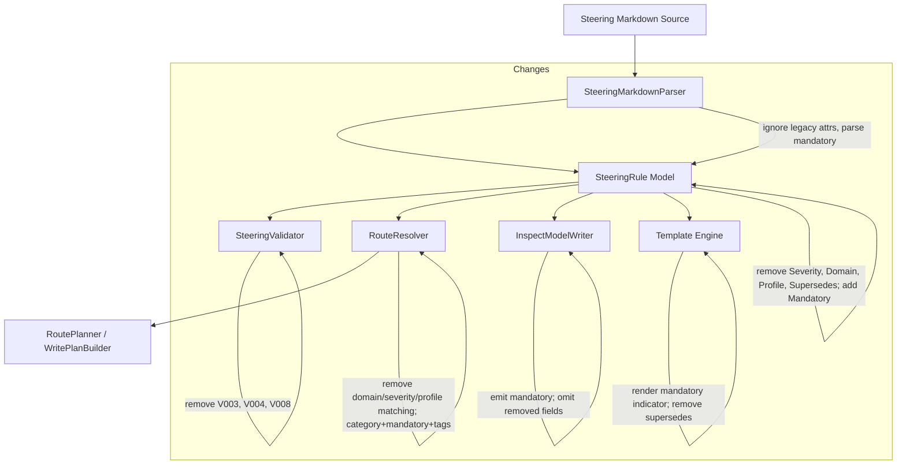

# Design Document: Simplify Rule Attributes

## Overview

This feature simplifies the `SteeringRule` attribute model by:

1. **Replacing** the multi-valued `Severity` enum (`error`, `warning`, `info`, `hint`) with a simple boolean `Mandatory` flag (defaults to `false`)
2. **Removing** the `Domain` property (redundant — routing now uses `Category` as primary discriminator)
3. **Removing** the `Profile` property (unused in practice)
4. **Removing** the `Supersedes` property (unused, along with its V008 cross-reference validation)

The change touches every layer of the pipeline: model types, parsing, validation, routing, inspect output, template rendering, default layout YAMLs, test fixtures, and documentation.

**Design rationale:** The current attribute model carries four fields that add complexity without proportional value. `Severity` forces authors to choose between four levels whose semantics are unclear in practice — the real distinction is "must comply" vs "advisory guidance". `Domain` duplicates information already expressed by file organisation and category-based routing. `Profile` and `Supersedes` are entirely unused. Removing them shrinks the public surface, simplifies routing logic, and reduces cognitive load for authors.

**Backward compatibility:** The parser will silently ignore legacy attributes (`severity`, `domain`, `profile`, `supersedes`) in existing documents, allowing incremental migration without breaking workflows.

## Architecture

The change is a vertical slice through the existing pipeline. No new components are introduced; existing components are simplified.



### Affected Components

| Component | Change Type | Impact |
|-----------|-------------|--------|
| `SteeringRule` | Model | Remove 4 properties, add 1 boolean |
| `RouteMatchExpression` | Model | Remove `Domain`, `Severity`, `Profile` fields; add nullable `Mandatory` filter |
| `SteeringMarkdownParser` | Parsing | Ignore legacy attrs, parse `mandatory` |
| `SteeringValidator` | Validation | Remove V003, V004, V008 checks |
| `RouteResolver` | Generation | Remove domain/severity/profile matching and specificity |
| `InspectModelWriter` | Generation | New DTO schema with `mandatory`, without removed fields |
| `LayoutOverrideLoader` | Configuration | Ignore `match.domain`, `match.severity`, `match.profile` in YAML |
| Default layout YAMLs | Targets | Replace `domain`-based routes with `category`-based |
| Scriban templates | Templates | Remove `supersedes`/`domain` refs, add `mandatory` indicator |
| `docs/routing-syntax.md` | Documentation | Remove domain/severity/profile from reference |
| Test fixtures | Tests | Update to new attribute format |

## Components and Interfaces

### SteeringRule (Model)

**Before:**
```csharp
public record SteeringRule
{
    public string? Id { get; init; }
    public RouteScope SourceScope { get; init; } = RouteScope.Both;
    public string Severity { get; init; } = "info";
    public string? Category { get; init; }
    public string Domain { get; init; } = "core";
    public string? Profile { get; init; }
    public IReadOnlyList<string> AppliesTo { get; init; } = [];
    public IReadOnlyList<string> Tags { get; init; } = [];
    public bool Deprecated { get; init; }
    public string? Supersedes { get; init; }
    public string? PrimaryText { get; init; }
    public string? ExplanatoryText { get; init; }
    public string? InputFileStem { get; init; }
}
```

**After:**
```csharp
public record SteeringRule
{
    public string? Id { get; init; }
    public RouteScope SourceScope { get; init; } = RouteScope.Both;
    public bool Mandatory { get; init; } = false;
    public string? Category { get; init; }
    public IReadOnlyList<string> AppliesTo { get; init; } = [];
    public IReadOnlyList<string> Tags { get; init; } = [];
    public bool Deprecated { get; init; }
    public string? PrimaryText { get; init; }
    public string? ExplanatoryText { get; init; }
    public string? InputFileStem { get; init; }
}
```

### RouteMatchExpression (Model)

**Before:**
```csharp
public record RouteMatchExpression
{
    public IReadOnlyList<string> Domain { get; init; } = [];
    public IReadOnlyList<string> TagsAny { get; init; } = [];
    public IReadOnlyList<string> Category { get; init; } = [];
    public IReadOnlyList<string> Severity { get; init; } = [];
    public IReadOnlyList<string> Profile { get; init; } = [];
    public IReadOnlyDictionary<string, string> SourceContext { get; init; } = ...;

    public bool IsEmpty => Domain.Count == 0 && TagsAny.Count == 0 && 
        Category.Count == 0 && Severity.Count == 0 && Profile.Count == 0 && 
        SourceContext.Count == 0;
}
```

**After:**
```csharp
public record RouteMatchExpression
{
    public IReadOnlyList<string> TagsAny { get; init; } = [];
    public IReadOnlyList<string> Category { get; init; } = [];
    public bool? Mandatory { get; init; } = null;
    public IReadOnlyDictionary<string, string> SourceContext { get; init; } = ...;

    public bool IsEmpty => TagsAny.Count == 0 && Category.Count == 0 && 
        Mandatory is null && SourceContext.Count == 0;
}
```

**Design note on `Mandatory` in routing:** The `Mandatory` field is a nullable boolean (`bool?`). When `null` (the default), the route does not filter on mandatory status — it matches rules regardless of their `Mandatory` value. When set to `true`, the route matches only mandatory rules. When set to `false`, the route matches only non-mandatory (advisory) rules. This enables layout authors to segregate mandatory rules into dedicated output files (e.g., a "hard-requirements" file vs a "guidance" file), which is critically important for downstream consumers that need to distinguish enforceable obligations from advisory guidance.

### SteeringMarkdownParser (Parsing)

The `ParseRuleAttributes` method changes:
- **Parse** `mandatory="true"` → set `Mandatory = true`
- **Ignore** `severity`, `domain`, `profile`, `supersedes` attributes (no error, no model population)
- **Default** `Mandatory = false` when attribute is absent

```csharp
private static SteeringRule ParseRuleAttributes(string attrString, string primaryText)
{
    var attrs = new Dictionary<string, string>(StringComparer.OrdinalIgnoreCase);
    foreach (Match m in AttributeRegex.Matches(attrString))
        attrs[m.Groups[1].Value] = m.Groups[2].Value;

    // Parse mandatory flag (new)
    attrs.TryGetValue("mandatory", out var mandatoryRaw);
    var mandatory = string.Equals(mandatoryRaw, "true", StringComparison.OrdinalIgnoreCase);

    // Legacy attributes (severity, domain, profile, supersedes) are silently ignored

    attrs.TryGetValue("appliesTo", out var appliesToRaw);
    attrs.TryGetValue("tags", out var tagsRaw);
    // ... parse appliesTo, tags, deprecated as before ...

    return new SteeringRule
    {
        Id = attrs.TryGetValue("id", out var id) ? id : null,
        Mandatory = mandatory,
        Category = attrs.TryGetValue("category", out var cat) ? cat : null,
        AppliesTo = appliesTo,
        Tags = tags,
        Deprecated = deprecated,
        PrimaryText = primaryText,
    };
}
```

### SteeringValidator (Validation)

**Remove:**
- `ValidSeverities` set and V003 check (invalid severity)
- V004 check (missing domain)
- `CheckSupersededRuleReferences` method and V008 diagnostic

**Retain:** V001 (missing doc ID), V002 (missing rule ID), V005 (empty body), V006 (control chars), V007 (duplicate rule IDs).

### RouteResolver (Generation)

**Matches method — before:**
```csharp
internal static bool Matches(RouteMatchExpression expr, SteeringRule rule)
{
    if (expr.IsEmpty) return true;
    if (!MatchesField(expr.Domain, rule.Domain)) return false;
    if (!MatchesField(expr.Category, rule.Category)) return false;
    if (!MatchesField(expr.Severity, rule.Severity)) return false;
    if (!MatchesField(expr.Profile, rule.Profile)) return false;
    if (!MatchesTagsAny(expr.TagsAny, rule.Tags)) return false;
    return true;
}
```

**Matches method — after:**
```csharp
internal static bool Matches(RouteMatchExpression expr, SteeringRule rule)
{
    if (expr.IsEmpty) return true;
    if (!MatchesField(expr.Category, rule.Category)) return false;
    if (!MatchesMandatory(expr.Mandatory, rule.Mandatory)) return false;
    if (!MatchesTagsAny(expr.TagsAny, rule.Tags)) return false;
    return true;
}

private static bool MatchesMandatory(bool? filter, bool ruleValue)
{
    // null filter = don't care (matches any rule)
    if (filter is null) return true;
    return filter.Value == ruleValue;
}
```

**ConditionSpecificity — after:**
```csharp
internal static int ConditionSpecificity(RouteMatchExpression expr)
{
    return FieldSpecificity(expr.Category)
         + FieldSpecificity(expr.TagsAny)
         + (expr.Mandatory is not null ? 1 : 0);
}
```

**ResolveDestination — after:**
```csharp
internal static string ResolveDestination(DestinationTemplate dest, SteeringRule rule)
{
    var vars = new Dictionary<string, string>(StringComparer.OrdinalIgnoreCase)
    {
        ["domain"] = "",       // legacy — always empty
        ["category"] = rule.Category ?? "",
        ["severity"] = "",     // legacy — always empty
        ["profile"] = "",      // legacy — always empty
        ["ruleId"] = rule.Id ?? "",
        ["inputFileStem"] = rule.InputFileStem ?? rule.Id ?? "",
    };
    // ... rest unchanged ...
}
```

Legacy template variables (`${domain}`, `${severity}`, `${profile}`) resolve to empty string for backward compatibility with user override YAMLs that may still reference them.

### LayoutOverrideLoader (Configuration)

**MapMatch — after:**
```csharp
private static RouteMatchExpression MapMatch(RouteMatchYamlDto? m)
{
    if (m is null) return new RouteMatchExpression();
    return new RouteMatchExpression
    {
        // Domain, Severity, Profile fields in YAML are silently ignored
        TagsAny = m.TagsAny ?? [],
        Category = m.Category ?? [],
        Mandatory = m.Mandatory,  // nullable bool — null means "don't filter"
    };
}
```

The `RouteMatchYamlDto` retains `Domain`, `Severity`, and `Profile` properties for YAML deserialization (so legacy override files don't cause parse errors), but the values are discarded during mapping. The DTO gains a new `bool? Mandatory` property that maps directly to the `RouteMatchExpression.Mandatory` filter.

**RouteMatchYamlDto — new field:**
```csharp
public bool? Mandatory { get; set; }  // null = match all, true = mandatory only, false = advisory only
```

### InspectModelWriter (Generation)

**New InspectRuleDto:**
```csharp
private sealed record InspectRuleDto(
    string? Id,
    bool Mandatory,
    string? Category,
    bool? Deprecated,
    IReadOnlyList<string> AppliesTo,
    IReadOnlyList<string> Tags,
    string? PrimaryText);
```

Fields removed: `Severity`, `Domain`, `Profile`, `Supersedes`.
Field added: `Mandatory` (always emitted as boolean).

### Default Layout YAMLs

Both Kiro and Speckit default layouts change from `match.domain`-based routing to `match.category`-based routing.

**Kiro default-layout.yaml (after):**
```yaml
routes:
  - id: core-global
    scope: global
    explicit: true
    anchor: core
    order: 10
    match:
      category: core
    destination:
      directory: "${targetRoot}"
      fileName: "${inputFileStem}"
      extension: ".md"

  - id: mandatory-global
    scope: global
    explicit: false
    order: 50
    match:
      category: "*"
      mandatory: true
    destination:
      directory: "${globalRoot}/.kiro/steering"
      fileName: "${category}-mandatory"
      extension: ".md"

  - id: catch-all-global
    scope: global
    explicit: false
    order: 100
    match:
      category: "*"
    destination:
      directory: "${globalRoot}/.kiro/steering"
      fileName: "${inputFileStem}"
      extension: ".md"

  # ... project scope routes similarly updated ...
```

**Note:** The `mandatory-global` route demonstrates how layout authors can segregate mandatory rules into dedicated files. When `match.mandatory` is omitted (as in `catch-all-global`), the route matches rules regardless of their mandatory status.

**Speckit default-layout.yaml (after):**
```yaml
routes:
  - id: core-global
    scope: global
    explicit: true
    anchor: core
    order: 10
    match:
      category: core
    destination:
      directory: "${targetRoot}"
      fileName: "constitution"
      extension: ".md"

  - id: category-module-global
    scope: global
    explicit: false
    order: 20
    match:
      category: "*"
    destination:
      directory: "${targetRoot}"
      fileName: "${category}"
      extension: ".md"

  # ... project scope routes similarly updated ...
```

### Scriban Templates

**kiro/document.scriban (after):**
```
- {{ if rule.id }}{{ rule.id }}{{ if rule.mandatory }} [MANDATORY]{{ end }}{{ if rule.deprecated }} (deprecated){{ end }}: {{ end }}{{ rule.primary_text }}
```

**speckit/constitution.scriban (after):**
```
- {{ rule.id }}{{ if rule.mandatory }} [MANDATORY]{{ end }}{{ if rule.deprecated }} (deprecated){{ end }}: {{ rule.primary_text }}
```

**speckit/module.scriban (after):**
- Remove `{{ domain }}` from heading (use category or a static heading)
- Remove `supersedes` references
- Add `mandatory` indicator

## Data Models

### SteeringRule Record (Final)

| Property | Type | Default | Description |
|----------|------|---------|-------------|
| `Id` | `string?` | `null` | Unique rule identifier |
| `SourceScope` | `RouteScope` | `Both` | Scope from source document context |
| `Mandatory` | `bool` | `false` | Whether rule is a hard requirement |
| `Category` | `string?` | `null` | Primary routing discriminator |
| `AppliesTo` | `IReadOnlyList<string>` | `[]` | Target applicability filter |
| `Tags` | `IReadOnlyList<string>` | `[]` | Freeform tags for matching |
| `Deprecated` | `bool` | `false` | Whether rule is deprecated |
| `PrimaryText` | `string?` | `null` | Rule body content |
| `ExplanatoryText` | `string?` | `null` | Optional explanatory content |
| `InputFileStem` | `string?` | `null` | Source file stem for routing |

### RouteMatchExpression Record (Final)

| Property | Type | Default | Description |
|----------|------|---------|-------------|
| `TagsAny` | `IReadOnlyList<string>` | `[]` | Match if rule has any of these tags |
| `Category` | `IReadOnlyList<string>` | `[]` | Match if rule category is in list |
| `Mandatory` | `bool?` | `null` | Filter by mandatory status: `null` = match all, `true` = mandatory only, `false` = advisory only |
| `SourceContext` | `IReadOnlyDictionary<string, string>` | `{}` | Arbitrary key-value metadata match |

### Inspect JSON Schema (Final)

```json
{
  "activeProfiles": ["..."],
  "documents": [
    { "id": "...", "title": "...", "version": "...", "sourcePath": "...", "tags": [], "profiles": [] }
  ],
  "rules": [
    {
      "id": "RULE-001",
      "mandatory": true,
      "category": "security",
      "deprecated": true,
      "appliesTo": ["backend"],
      "tags": ["pii"],
      "primaryText": "..."
    }
  ]
}
```

## Correctness Properties

*A property is a characteristic or behavior that should hold true across all valid executions of a system — essentially, a formal statement about what the system should do. Properties serve as the bridge between human-readable specifications and machine-verifiable correctness guarantees.*

### Property 1: Mandatory attribute round-trip preservation

*For any* valid `SteeringRule` with `Mandatory` set to either `true` or `false`, serializing the rule to a `:::rule` block (with `mandatory="true"` when true, omitted when false), then parsing that block back, SHALL produce a rule with the same `Mandatory` value.

**Validates: Requirements 1.6**

### Property 2: Mandatory parsing correctness

*For any* `:::rule` block with valid attributes, the parsed `Mandatory` value SHALL equal `true` if and only if the attribute string contains `mandatory="true"` (case-insensitive on the value). In all other cases (attribute absent, or any value other than "true"), `Mandatory` SHALL be `false`.

**Validates: Requirements 1.3, 1.4**

### Property 3: Legacy attribute backward compatibility

*For any* document containing `:::rule` blocks with any combination of legacy attributes (`severity`, `domain`, `profile`, `supersedes`) and/or new attributes (`mandatory`, `category`, `id`, `tags`, `appliesTo`, `deprecated`), the parser SHALL produce a valid `SteeringRule` without error, with `Mandatory` defaulting to `false` when the `mandatory` attribute is absent, and with no model properties reflecting the legacy attribute values.

**Validates: Requirements 1.5, 2.2, 3.2, 4.2, 11.1, 11.2, 11.3, 11.4**

### Property 4: Removed diagnostics never produced

*For any* valid or invalid `SteeringRule` and *for any* corpus of `SteeringDocument` instances, the validator SHALL never produce diagnostics with codes V003, V004, or V008.

**Validates: Requirements 2.3, 4.3, 7.1, 7.2, 7.3**

### Property 5: Retained diagnostics still fire

*For any* `SteeringDocument` missing an `id` (V001), or containing a rule missing an `id` (V002), or containing a rule with empty body text (V005), or containing control characters in primary text (V006), or containing duplicate rule IDs across a corpus (V007), the validator SHALL produce the corresponding diagnostic.

**Validates: Requirements 7.4**

### Property 6: Route matching depends only on category, mandatory, and tags

*For any* `SteeringRule` and *for any* `RouteMatchExpression`, the result of `Matches(expr, rule)` SHALL depend only on the rule's `Category`, `Mandatory`, and `Tags` values (and the expression's `Category`, `Mandatory`, `TagsAny`, and `SourceContext` fields). Changing any other rule metadata (e.g., `Id`, `AppliesTo`, `Deprecated`, `PrimaryText`) SHALL not affect the match result.

**Validates: Requirements 2.5, 2.7, 3.4, 5.2, 12.3, 12.4**

### Property 6a: Mandatory filter semantics

*For any* `SteeringRule` with `Mandatory = M` and *for any* `RouteMatchExpression`:
- When `expr.Mandatory` is `null`, the expression SHALL match the rule regardless of `M`.
- When `expr.Mandatory` is `true`, the expression SHALL match the rule if and only if `M` is `true`.
- When `expr.Mandatory` is `false`, the expression SHALL match the rule if and only if `M` is `false`.

**Validates: Requirements 5.2 (routing uses category as primary discriminator, mandatory as secondary segregation)**

### Property 7: Category template substitution

*For any* `SteeringRule` with a non-null `Category` value and *for any* `DestinationTemplate` containing `${category}`, the resolved destination path SHALL contain the rule's category value in place of the `${category}` token. The tokens `${domain}`, `${severity}`, and `${profile}` SHALL resolve to empty string.

**Validates: Requirements 2.8, 3.6, 5.4**

### Property 8: Inspect JSON schema correctness

*For any* `ResolvedSteeringModel`, the JSON output from `InspectModelWriter.Write` SHALL include a `mandatory` boolean field for every rule object, SHALL NOT include `severity`, `domain`, `profile`, or `supersedes` fields in any rule object, and SHALL produce rules sorted by ID.

**Validates: Requirements 4.4, 8.1, 8.2, 8.3**

### Property 9: Template rendering excludes removed attributes and includes mandatory

*For any* `SteeringRule` rendered through any Scriban template, the output SHALL NOT contain `[Supersedes:` text, and when `Mandatory` is `true` the output SHALL contain a mandatory indicator (e.g., `[MANDATORY]`).

**Validates: Requirements 4.5, 10.1, 10.2, 10.3, 10.4, 10.5**

### Property 10: Route resolution determinism

*For any* `SteeringRule` and `TargetLayoutDefinition`, calling `RouteResolver.Resolve` multiple times with the same inputs SHALL produce identical `RouteResolutionResult` values (same `SelectedRouteId`, same `SelectedDestinationPath`).

**Validates: Requirements 5.5, 8.3**

## Error Handling

### Parser Error Handling

- **Legacy attributes in source documents:** Silently ignored. No diagnostic, no error. The parser's `IgnoreUnmatchedProperties()` YAML configuration and the attribute dictionary approach already support this — unknown keys are simply not read.
- **Invalid `mandatory` value** (e.g., `mandatory="yes"`): Treated as `false`. Only the exact string `"true"` (case-insensitive) sets `Mandatory = true`. This is consistent with how `deprecated` is already parsed.
- **Malformed rule blocks:** Existing error handling unchanged — malformed blocks are skipped.

### Validator Error Handling

- Removed diagnostics (V003, V004, V008) are simply not emitted. No replacement diagnostics are needed.
- All remaining diagnostics (V001, V002, V005, V006, V007) continue to function identically.

### Layout Loader Error Handling

- **Legacy `match.domain`/`match.severity`/`match.profile` in override YAML:** Silently ignored during mapping. The YAML DTO still accepts these fields (so deserialization doesn't fail), but `MapMatch` discards them.
- **Legacy `${domain}`/`${severity}`/`${profile}` in destination templates:** Resolve to empty string. This prevents path errors while signaling to users that these variables are no longer meaningful.

### Route Resolver Error Handling

- **No matching route:** Unchanged — returns an unresolved `RouteResolutionResult` and the fallback mechanism applies.
- **Empty category on rule:** Category-based matching with a `"*"` wildcard still matches rules with null/empty category. Specific category filters won't match null categories (existing `MatchesField` behavior).

## Testing Strategy

### Property-Based Testing (Primary Strategy)

**Library:** CsCheck 4.6.2 with xUnit  
**Minimum iterations:** 100 per property test  
**Tag format:** `Feature: simplify-rule-attributes, Property {N}: {title}`

Each correctness property above maps to one or more CsCheck property tests:

| Property | Test File | Generator Strategy |
|----------|-----------|-------------------|
| 1: Round-trip | `Parsing/MandatoryRoundTripProperties.cs` | Generate random rule IDs, categories, tags, mandatory values; serialize to markdown; parse back |
| 2: Mandatory parsing | `Parsing/MandatoryParsingProperties.cs` | Generate random attribute strings with/without mandatory; verify parsed value |
| 3: Legacy compat | `Parsing/LegacyAttributeProperties.cs` | Generate rule blocks with random combinations of legacy + new attrs |
| 4: Removed diagnostics | `Validation/RemovedDiagnosticProperties.cs` | Generate random rules/corpora; verify V003/V004/V008 never appear |
| 5: Retained diagnostics | `Validation/RetainedDiagnosticProperties.cs` | Generate rules violating V001/V002/V005/V006/V007; verify diagnostics fire |
| 6: Route matching | `Generation/CategoryRoutingProperties.cs` | Generate random rules and match expressions; verify only category/mandatory/tags affect matching |
| 6a: Mandatory filter | `Generation/MandatoryFilterProperties.cs` | Generate rules with random mandatory values and expressions with null/true/false; verify filter semantics |
| 7: Template substitution | `Generation/DestinationSubstitutionProperties.cs` | Generate rules with categories and templates with ${category}; verify substitution |
| 8: Inspect JSON | `Generation/InspectJsonSchemaProperties.cs` | Generate random models; verify JSON schema correctness |
| 9: Template rendering | `Generation/TemplateRenderingProperties.cs` | Generate random rules; render through templates; verify output |
| 10: Determinism | `Generation/RouteResolverDeterminismProperties.cs` | Generate random rules and layouts; verify repeated resolution is identical |

### Unit Tests (Complementary)

Example-based tests for specific scenarios:

- Layout YAML with legacy `match.domain` field loads without error
- Layout YAML with legacy `match.severity` field loads without error  
- Layout YAML with legacy `match.profile` field loads without error
- Default Kiro layout uses category-based matching (smoke test)
- Default Speckit layout uses category-based matching (smoke test)
- `${domain}` in destination template resolves to empty string
- `${profile}` in destination template resolves to empty string
- `${severity}` in destination template resolves to empty string
- Default-constructed `SteeringRule` has `Mandatory == false`

### Integration Tests

- End-to-end `steergen run` with legacy documents produces valid output
- End-to-end `steergen inspect` produces JSON with new schema
- End-to-end `steergen validate` does not produce V003/V004/V008

### Test Fixture Updates

All `:::rule` blocks in `tests/Fixtures/RealisticGovernance/` updated to:
- Use `mandatory="true"` or omit (defaulting to false) instead of `severity`
- Remove `domain`, `profile`, `supersedes` attributes
- Retain realistic governance content
